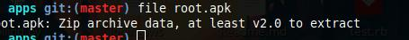

## Frida For android

---

## Topics 

- Introduction to  apk
- File inside the apk
- Reversing the apps
- frida
- Dynamic  Binary Instrumentatation
- Common Challenges while pentesting Android
- Modes of operation
- Frida Installation(Hands-on)
- Frida Common Api for Android 
- Hands on
- Frida Gadget
- References


---
## Outcomes

- Setting up the Frida
- Learn Basic Frida Commands
- Reverse Enginnering and Bypassing the apps 

---
# What is apk?

> file [appname]





---
### Unzipping the apk

Open the gitbook and follow the instruction

---

### Files inside the apk
 
 - META-INF
 - lib
 - res
 - assets
 - AndroidManifest.xml
 - classes.dex
 - resources.arsc


---
# Reversing our first app

Open the gitbook and try to follow the apktool section


---
# Reversing the App (Human-readable way)

 Open the gitbook and try to read the Reversing-the app section

---

## What is Frida


- Dynamic binary instrumentation tool


---
## What is Dynamic Binary Instrumentation

Types of Dynamic  Instrumentation

1) Injected

2) Embeded

---


---
## Why frida

How we change the app logic ?

## Smali reversing


---

---

## Dynamic Binary Instumenation


---
## Common Challenges While pentsting android apps 
1. Root Bypassing
2. Anti Debugging
3. Anti Emulation
4. Bypassing App Logic 
---
# Modes of operation

## Injected
1. spawn an existing process
2. hook to the running program
3. Requires the root access

---

## Embeded

1. Frida-gadget  a shared library


## Preloaded
1. Using a dynamic linker feature like LD_PRELOAD or DYLD_INSERT_LIBRARIES
2. Not used in android
---

## Frida Installation

open the gitbook Try to install Frida 
---
## Frida Basics

open the gitbook Try to run the basic Frida command
---

## Frida Api for Android

1. Java.perform - call the function
2. Java.use-use the particular class
     
``` 
 var   main = Java.use("sg.vantagepoint.root.MainActivity");
```
---
3. .implementation-override the existing function
       main.isDeviceRooted.implementation
4. .overload-to use polymorphism
       .overload(“datatype”).implementation

---
## Sample javascript payload
``` javascript

Java.perform(function() {

        var   main = Java.use("sg.vantagepoint.root.MainActivity");

       main.function-name.implementation = function() {
            console.log("In function A");
             return false;
         }  
   

});

```


---
### Hands on


---
## Challenge

<video width="700" height="700" controls>
  <source src="challenge.mp4" type="video/mp4">
</video>

---
## Frida Gadget (Hooking Only)

1. Find device architecture
2. Reverse the app
3. Inject frida-gadget.
4. Injecting smali hook.
5. Add the 	permission
6. Repackage the pack
7. Sign the apk
---
## Open the gitbook

 follow the Frida-gadget Section
---


---
### References

- https://koz.io/using-frida-on-android-without-root/

- https://securitygrind.com/ssl-pinning-bypass-with-frida-gadget-gadget-injector-py/

- https://www.slideshare.net/ChandrapalBN/pentesting-android-apps-using-frida-beginners

- https://resources.infosecinstitute.com/frida/

- https://www.frida.re/docs/android/


